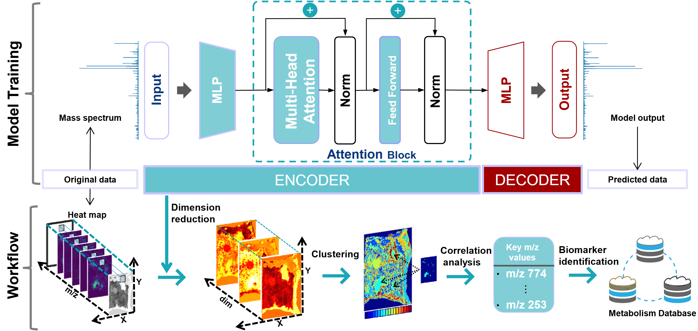
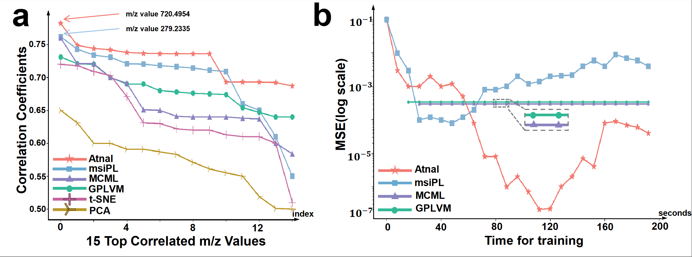

# Attention-based pattern discovery of mass spectrometry imaging data :rocket: 

 

#  

## Workflow

This readme file shows how to properly run the code of Atnal      (Jiang et al,):
Guoqing Jiang et al, Attention-based pattern discovery of mass spectrometry imaging data.

License:	Attention-based pattern discovery of mass spectrometry imaging data will be shared using the 3D Slicer Software License agreement.

## ABSTRACT
Mass spectrometry imaging (MSI) enables the direct visualization of molecular distributions in tissue sections, making it a crucial
method in metabolomics research. However, the vast size and high dimensionality of MSI data pose challenges for analysis even
though there are already many conventional machine learning methods used in this area, such as the "Curse of dimensionality" problem. Therefore, compressing sparse distributions of raw data while ensuring minimal information loss is important. In response to
these challenges, we propose Atnal, an attention-based generative model. Atnal effectively maps MSI data to a low-dimensional space
with an extremely low loss, which can contribute to the pattern discovery of MSI data. Then Atnal is applied
in the domain of cancer region recognition and correlation analysis. As it is presented, Atnal can distinguish the regions primarily
containing cancer cells from those with normal cells and identify highly correlated metabolites with cancer (correlation coefficient up
to 0.79). Atnal can provide quantitative guidance for the clinical removal of cancerous tissue, helping to avoid subjective bias and
further aid in clinical cancer diagnosis.
## Quantitative Comparative Analysis of Model Performance

  

  <strong>(a):</strong> The m/z values identified by Atnal exhibit significantly higher correlations with cancerous regions compared to those found by msiPL, as observed in the dataset of colorectal adenocarcinoma. Moreover, Atnal effectively circumvents the omission of crucial m/z values. Baselines include: msiPL[7], MCML[24], GPLVM[25], t-SNE, and PCA. 

  <strong>(b):</strong> The logarithmic mean squared errors between original and reconstructed MSI data computed via various techniques. Here, t-SNE and PCA in subplot (a) are not included due to their poor performances. Even when contrasted with the latest methods msiPL and MCML, Atnal demonstrates an error reduction of at least two orders of magnitude.

## How to run this code?
1. **DIR: data:**
   - The colorectal adenocarcinoma dataset should be placed at "./data/Colorectal_Adenocarcinoma.h5'", which can be downloaded from [here](https://s3.ap-northeast-1.wasabisys.com/gigadb-datasets/live/pub/10.5524/100001_101000/100131/Colorectal_Adenocarcinoma/Colorectal_Adenocarcinoma.h5).
   -  The prostate cancer dataset should be placed at "./data/Prostate/P_1900.h5'", which have been preprocessed using original files. The original files can be downloaded from [here](https://www.metabolomicsworkbench.org/data/DRCCStudySummary.php?Mode=SetupRawDataDownload&StudyID=ST001857). Then, please run the script in "Atnal_prostate.ipynb" to generate the preprocessed data and  subsequential analysis.
2. **Atnal_3DColorectal_trans.ipynb** and **Atnal_prostate_trans.ipynb**:
   - These are the main files which are independent from each other. 
   - We have provided required comments for instructions and guidance. In this file you will be able to:
     1. Load a dataset.
     2. Load the computational neural network architecture (Atnal).
     3. Train the model.
     4. Perform non-linear dimensionality reduction.
     5. Evaluate the learning quality by estimation and reconstruction of the original data.
     6. Perform data clustering (GMM).
     7. Identify localized peaks within each cluster.

3. **Computational_Model_trans.py** :
   - Components of the Atnal (our neural networks).

4. **DIR: CV_Values**:
   - This folder stores the sample allocation results of K-fold cross validation, only for colorectal carcinoma dataset.

5. **DIR: Saved_models**:
   - This folder stores the model weights during training.

6. **DIR: pic**:
   - This folder stores the visualization details of the training process.
We provide a sample of a publicly available MSI data to train and test the model and to ensure reproducibility.

##    Acknowledgements

Corresponding author: Cong Wu.(https://yjs.cd120.com/contents/559/1710.html)