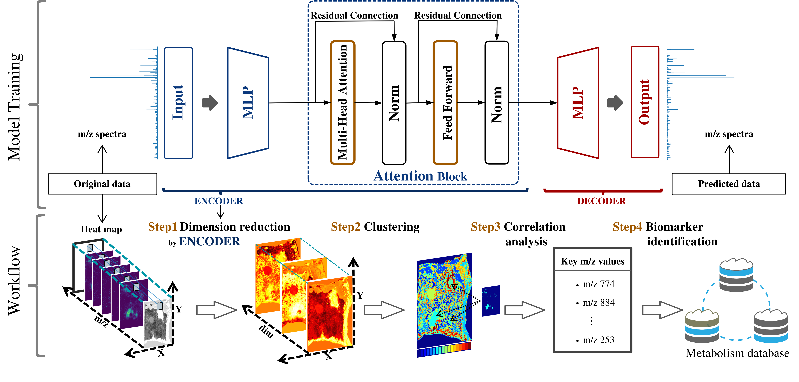

# Attention-based pattern discovery of mass spectrometry imaging data

This readme file shows how to properly run the code of Atnal(Jiang et al,):
Guoqing Jiang et al, Attention-based pattern discovery of mass spectrometry imaging data.

License:	Attention-based pattern discovery of mass spectrometry imaging data will be shared using the 3D Slicer Software License agreement.

## ABSTRACT
Mass spectrometry imaging (MSI) enables the direct visualization of molecular distributions in tissue sections, making it a crucial
method in metabolomics research. However, the vast size and high dimensionality of MSI data pose challenges for analysis even
though there are already many conventional machine learning methods used in this area, such as the "Curse of dimensionality" problem. Therefore, compressing sparse distributions of raw data while ensuring minimal information loss is important. In response to
these challenges, we propose Atnal, an attention-based generative model. Atnal effectively maps MSI data to a low-dimensional space
with an extremely low loss (2 × 10−7 ∼ 7 × 10−9
), which can contribute to the pattern discovery of MSI data. Then Atnal is applied
in the domain of cancer region recognition and correlation analysis. As it is presented, Atnal can distinguish the regions primarily
containing cancer cells from those with normal cells and identify highly correlated metabolites with cancer (correlation coefficient up
to 0.79). Atnal can provide quantitative guidance for the clinical removal of cancerous tissue, helping to avoid subjective bias and
further aid in clinical cancer diagnosis.

## DEMO

### How to run the code?

1. **Atnal_3DColorectal.ipynb** and **Atnal_3DColorectal.ipynb**:
   - These are the main files which are independent from each other. 
   - We have provided required comments for instructions and guidance. In this file you will be able to:
     1. Load a dataset.
     2. Load the computational neural network architecture (Atnal).
     3. Train the model.
     4. Perform non-linear dimensionality reduction.
     5. Evaluate the learning quality by estimation and reconstruction of the original data.
     6. Perform data clustering (GMM).
     7. Identify localized peaks within each cluster.

2. **Computational_Model_trans.py** :
   - Implementation of the Atnal (our neural networks).

3. **LearnPeaks.py**:
   - Implementation of a function that identifies peaks of interest. 
   - It should be called after training the model.
4. **gmm.py**:
   - Subcomponent of Gaussian Mixture Clustering, called directly from the main files.
5. **Template**:
   - Pictures used in the paper.
We provide a sample of a publicly available MSI data to train and test the model and to ensure reproducibility.

##    Acknowledgements

This work was supported by National Natural Science Foundation of China
(Grant 12101430) and Department of Science and Technology of Sichuan
Province (Grant 2021ZYD0018). (Corresponding author: Cong Wu.)(https://yjs.cd120.com/contents/559/1710.html)