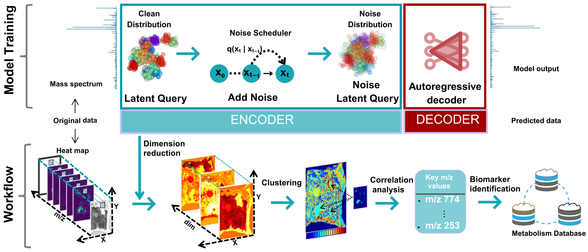

# Towards precision oncology: unsupervised manifold learning for spatial molecular profiling in cancer tissues :rocket: 
 

#  

## Workflow

This readme file shows how to properly run the code of Atnal (Jiang et al.):
Guoqing Jiang et al, Towards precision oncology: unsupervised manifold learning for spatial molecular profiling in cancer tissues.

## ABSTRACT
Precision oncology relies on the accurate characterization of spatial molecular distributions 
in cancer tissues to uncover critical biomarkers and guide clinical decision-making. However, 
the high dimensionality and complexity of mass spectrometry imaging (MSI) data pose significant 
challenges for effective analysis. This study presents an unsupervised manifold learning framework 
to address these challenges by mapping high-dimensional MSI data into a low-dimensional space while 
preserving essential molecular patterns. This method enables efficient dimensionality reduction, 
clustering, and visualization of MSI data, facilitating the discovery of spatially resolved molecular 
features. Applied to datasets from prostate cancer and colorectal adenocarcinoma, the proposed method 
accurately identifies cancerous regions and reveals highly correlated molecular markers with Pearson 
correlation coefficients up to 0.79. These findings demonstrate the potential of unsupervised manifold 
learning to enhance the interpretability and utility of MSI data in precision oncology, 
paving the way for improved biomarker discovery and cancer diagnostics.

## How to run this code?
1. **DIR: data:**
   - All required datasets can be found in the original paper. Please refer to the **METHODOLOGY - Experimental datasets** section of the paper for dataset sources and access information. Then, please run the script in "Atnal_prostate_trans.ipynb" to generate the preprocessed data and subsequent analysis.
2. **Atnal_3DColorectal_trans.ipynb** and **Atnal_prostate_trans.ipynb**:
   - These are the main files which are independent from each other. 
   - We have provided required comments for instructions and guidance. In this file you will be able to:
     1. Load a dataset.
     2. Load the computational neural network architecture (Atnal).
     3. Train the model.
     4. Perform non-linear dimensionality reduction.
     5. Evaluate the learning quality by estimation and reconstruction of the original data.
     6. Perform data clustering (GMM).
     7. Identify localized peaks within each cluster.

3. **Computational_Model_trans.py** :
   - Components of the Atnal (our neural networks).

4. **DIR: CV_Values**:
   - This folder stores the sample allocation results of K-fold cross validation, only for colorectal carcinoma dataset.

5. **DIR: Saved_models**:
   - This folder stores the model weights during training.

6. **DIR: pic**:
   - This folder stores the visualization details of the training process.
